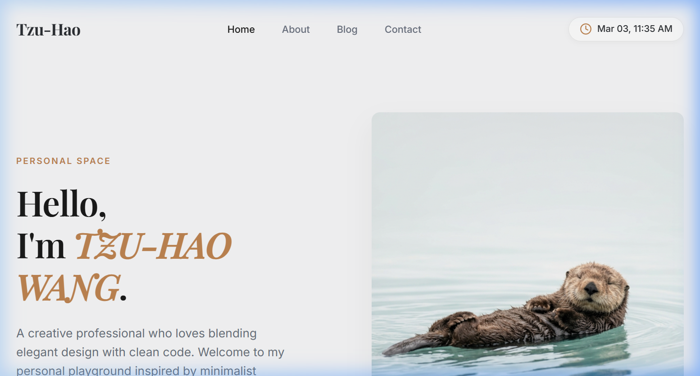

<div align="center">
  
  # 🦦 Tzu-Hao Wang | Personal Website
  
  **An elegant, responsive, and minimalist personal playground.**
  
  [](https://github.com/wangzi919/Personal-Website)
  [](LICENSE)
  [](https://github.com/wangzi919/Personal-Website/releases)

  ---
  
  [**Live Demo**](#insert-live-demo-link-here) •
  [**Report Bug**](https://github.com/wangzi919/Personal-Website/issues) •
  [**Request Feature**](https://github.com/wangzi919/Personal-Website/issues)

</div>

<br />

<!-- PROJECT BANNER/HERO IMAGE -->
> 🖼️ *Homepage Hero Section*  
> 

## 🎯 Overview

Welcome to my personal website repository! This project is crafted to be a clean, visually engaging, and highly functional digital representation of myself. Drawing inspiration from modern web design principles and my favorite animal—the resourceful *sea otter*—this site showcases my professional background, creative projects, and technical skills.

## ✨ Features

- **Responsive Design**: Beautifully adaptable layout that looks great on diverse screen sizes.
- **Premium Aesthetics**: Elegant typography featuring *Playfair Display* & *Inter*, alongside ample whitespace.
- **Dynamic Time Widget**: A fully customized, live JavaScript widget displaying current localized timezone metrics in a sleek ISO-style format.
- **Minimalist Theming**: Designed thoughtfully avoiding clutter while prioritizing content readability.

<br />

<!-- PLACEHOLDER FOR SCREENSHOT GALLERY -->
## 📸 Gallery

*Add a few screenshots to show off different sections (e.g., About Me, Live Time Widget).*

| Hero Section | About Me | Time Widget |
| :---: | :---: | :---: |
| *[Insert Image here]* | *[Insert Image here]* | *[Insert Image here]* |

<br />

## 🛠️ Tech Stack

This project was built using standard, framework-less, high-performance web languages:

-  **HTML5**: Semantic and structural code skeleton.
-  **CSS3**: Custom layouts, transitions, grid architectures, and flexbox models.
-  **JavaScript (Vanilla)**: Efficient script executions for responsive DOM manipulation (like the live clock).

<br />

## 🚀 Installation & Setup

Want to run this locally? It's incredibly simple since there are no heavy dependencies or frameworks needed.

1. **Clone the repository**
   ```bash
   git clone https://github.com/wangzi919/Personal-Website.git
   ```
2. **Navigate to the directory**
   ```bash
   cd Personal-Website
   ```
3. **Open the project**
   Simply double-click the `index.html` file to open it in your default web browser! No build tools or dev server required. *(Alternatively, use an extension like VSCode's Live Server for hot-reloads).*

<br />

## 👨‍💻 Author

**Tzu-Hao Wang**  
Creative Professional blending elegant design with clean code.
- GitHub: [@wangzi919](https://github.com/wangzi919)
- [Insert LinkedIn/Portfolio link]

## 📝 License

This project is open source and available under the [MIT License](LICENSE).
